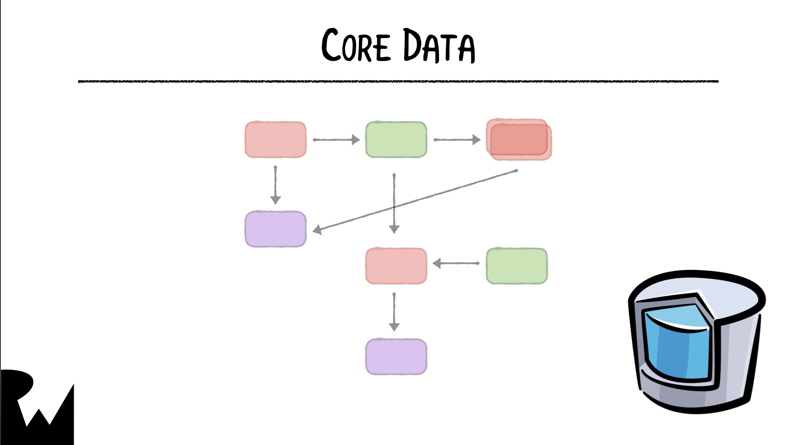

# Local Storage in iOS

## User Defaults
#### What is user defaults?
User defaults is a built in ***Data Dictionary*** that stores data for as long as the app is installed.

User defaults ca store integers, booleans, strings, arrays, dictionaries, dates and more.

#### How is it used?
```swift
let defaults = UserDefaults.standard
defaults.set(32, forKey: "Age")
defaults.set(true, forKey: "CanSentNotification")
defaults.set(Date(), forKey: "Birthday")
defaults.set("User", forKey: "userName")
```

```swift
let array = ["local", "storage"]
defaults.set(array, forKey: "Array")

let dict = ["name": "Simon", "country": "UK"]
defaults.set(dict, forKey: "Dict")
```
#### How to read stored data?
```swift
let age = defaults.integer(forKey: "Age")
let canNotify = defaults.bool(forKey: "CanSentNotification")
let date = defaults.string(forKey: "userName")
```
When retreving objects the result is **optional**, so we need to ***type-cast*** to a non-optional type and use a ***nil coalising*** operator to handle missing values.

```swift
let savedArray = defaults.object(forKey: "Array") as? [String] ?? [String]()
```


# How to store data on an iOS device using the core data framework.
#### What is core data?
Core data is an extremly powerful ***framework*** that abstracts much of the details of how and where the data is aculty stored, allowing the developer to focus on what you need to save.

You can use the framework to: 
- Store Data permently for offline use.
- Cache temporary data.
- Functionality like undos and redos.

While the how of the framework works the same under the hood, it uses different format to achive that in **SwiftUI** Vs in **UIKit**.

## A High level Overview of core data's parts
Core data mailny consists of an **Object Graph Mapper (OGM)** and a **Presistant Store**.

- The object graph represents the different objects in the model layer and thier relationship to one another and the rules of these relationships.




Once you have instenses of these models, you'll need to save, update, or delete. 

- The persistence framework provided by core data handels all of these operations.


Each of the operations needed is generally delegated to a very spesific objects. All of these object are reffered to as the **Core Data Stack**. 

#### Manged Object Model
With core dara we don't use swift types to model the data insted we use a **Managed Object**
- A managed object looks and feels like a swift class, but it's more of a representaion of the data in the presistance store.
- Instead of being a spesific type a manged object is a sub class of **NSManagedObject** and it's more of a generic container to store data in.
- Instead of creating objects direclty in code, core data provies a viual interface to define the types that you'll use to represent your data. These types are called **Entities**.


#### Managed Object Context
As you work with your app you'll need a way to keep track of all changes, this is where the next part of the stack comes in.
The managed object context is an intellegent scratch pad, keeps track of all changes occuring in the object graph. 


## Core Data Fetch Request
Fetch requests are represented by **NSFetchRequest** and it containts an entity discription and also optionaly sorting and filtring for retrived data.


# CoreData and UIKIT

While all the fundementals are the same as coredata in SwiftUI, the syntax, helper classes and how they are used are different.
- There's no Enviroment object in UIKIT, so we need to pass the mange object context manually whenever needed.
- There're no property observers to handle fetch requests.
- Unlike SwiftUI, the views wont be automatically updated when data in the preisitant store changes.

